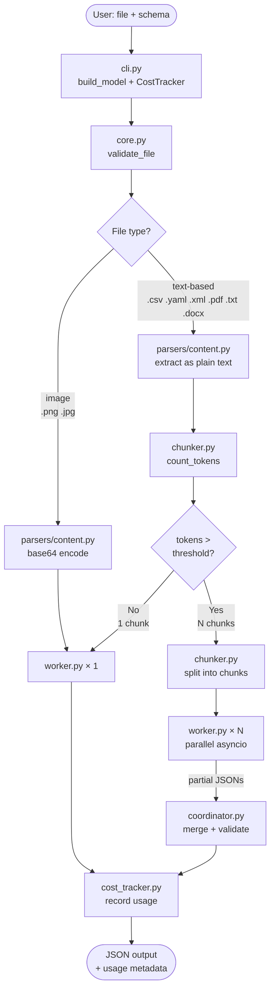

# any2json-py Flow Diagram

## Key Decision Points

| Condition | Agent flow |
|---|---|
| image | 1 worker (vision message) |
| text-based ≤ threshold | 1 worker (full content) |
| text-based > threshold | N workers in parallel → coordinator |

The worker is the single unit of LLM execution in all cases. The coordinator is only invoked when there are multiple workers.

## Token Threshold

Default: `context_threshold_tokens: 100000` in `config.yml`. Lower it to force multi-agent flow for testing.
