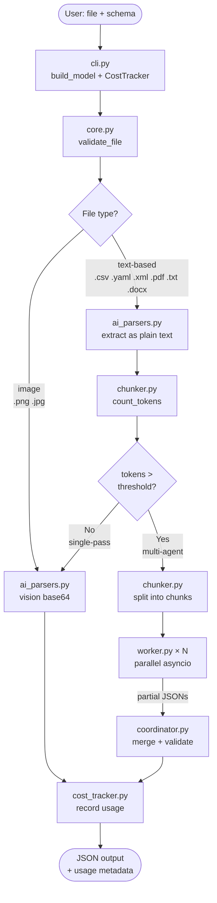

# any2json-py Flow Diagram

## Key Decision Points

| Condition | Path |
|---|---|
| `.png` / `.jpg` | Vision API, base64 encoded |
| any text-based format ≤ threshold | Single-pass AI extraction |
| any text-based format > threshold | Multi-agent: workers → coordinator |

## Token Threshold

Default: `CONTEXT_THRESHOLD_TOKENS=100000`. Override in `.env` to force multi-agent flow for testing.
